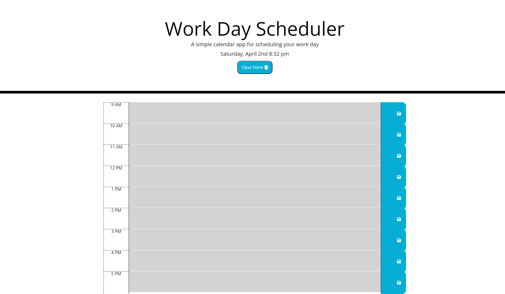

# Third-Party APIs Challenge: Work Day Scheduler

-When the planner is opened the current day of the week, date and time is displayed

-When the user scrolls down they are presented with time blocks for standard business hours

-Each time block is color-coded to indicate whether it is in the past, present, or future

-When the user clicks a time block they can enter an event

-When the user clicks the save button for that time block the text for that event is saved in local storage

-When then user refreshes the page the saved events persist

[Site Link] https://woodb58.github.io/work-day/

### Credits

Font Awesome Icons -https://fontawesome.com/
